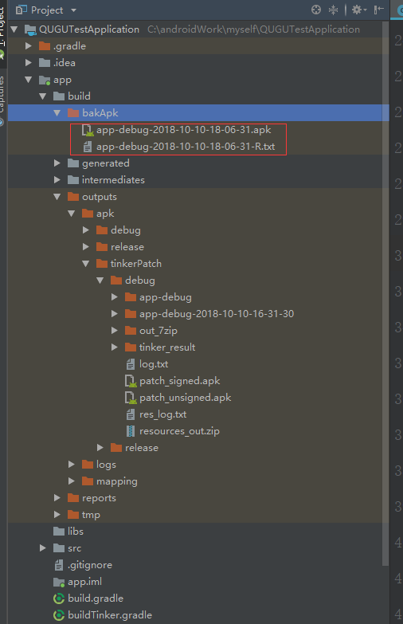
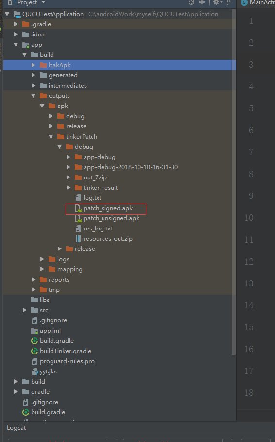

### Tinker --Android热修复接入文档  ——Nanfeng

#### 官方文档和辅助接入文章
   1. 官方文档  https://github.com/Tencent/tinker
   2. 参考文章（不可照搬）https://blog.csdn.net/qq_30379689/article/details/78575473
  
#### 接入说明
1.  全局 `build.gradle` 中 引入如下：

```
 // Tinker
        classpath ("com.tencent.tinker:tinker-patch-gradle-plugin:${TINKER_VERSION}"){
          exclude group: 'com.android.tools.build', module: 'gradle'
      }
```
2. `gradle.properties` 中添加  `TINKER_VERSION=1.9.9` （根据官方最新版本来）
3. 在 `app`下的`build.gradle`中引入Tinker的包：

```
   //添加tinker
    implementation("com.tencent.tinker:tinker-android-lib:${TINKER_VERSION}")
    annotationProcessor("com.tencent.tinker:tinker-android-anno:${TINKER_VERSION}")
    compileOnly("com.tencent.tinker:tinker-android-anno:${TINKER_VERSION}")
    implementation "com.android.support:multidex:1.0.1"
```
  并且修改当前配置文件如下：

```
  android {
    compileSdkVersion 28
    defaultConfig {
        applicationId "com.example.yyt.qugutestapplication"
        minSdkVersion 23
        targetSdkVersion 28
        versionCode 1
        versionName "1.0"
        testInstrumentationRunner "androidx.test.runner.AndroidJUnitRunner"
        multiDexEnabled true
        buildConfigField "String", "MESSAGE", "\"I am the base apk\""
        buildConfigField "String", "PLATFORM", "\"all\""
    }
    compileOptions {
        sourceCompatibility JavaVersion.VERSION_1_7
        targetCompatibility JavaVersion.VERSION_1_7
    }
    dexOptions {
        jumboMode = true
    }
    signingConfigs {//测试和使用前自行创建签名文件
        release {
            keyAlias 'yyt'
            keyPassword '123456'
            storeFile file("yyt.jks")
            storePassword '123456'
        }
    }
    buildTypes {
        release {
            minifyEnabled true
            proguardFiles getDefaultProguardFile('proguard-android.txt'), 'proguard-rules.pro'
           signingConfig signingConfigs.release
        }
        debug {
            minifyEnabled false
            signingConfig signingConfigs.release
        }
    }
    sourceSets {
        main {
            jniLibs.srcDirs = ['libs']
        }
    }
}
```
4. 在 `app` 下新建  `buildTinker.gradle`，添加如下内容，并且在`build.gradle`中引用：

```
//指定生成apk文件的存放位置
def bakPath = file("${buildDir}/bakApk/")
//参数配置
ext {
    //开启Tinker
    tinkerEnable = true
    //旧的apk位置，需要我们手动指定，填入上一个版本的文件名，便于生成补丁包
    tinkerOldApkPath = "${bakPath}/app-debug-2018-10-10-16-31-30.apk"
    //旧的混淆映射位置，如果开启了混淆，则需要我们手动指定
    tinkerApplyMappingPath = "${bakPath}/"
    //旧的resource位置，需要我们手动指定
    tinkerApplyResourcePath = "${bakPath}/app-debug-2018-10-10-16-31-30.txt"
    tinkerID = "1.0"
}

def buildWithTinker() {
    return ext.tinkerEnable
}

def getOldApkPath() {
    return ext.tinkerOldApkPath
}

def getApplyMappingPath() {
    return ext.tinkerApplyMappingPath
}

def getApplyResourceMappingPath(){
    return ext.tinkerApplyResourcePath
}

def getTinkerIdValue(){
    return ext.tinkerID
}

if (buildWithTinker()) {
    apply plugin: 'com.tencent.tinker.patch'

    tinkerPatch {
        oldApk = getOldApkPath() //指定old apk文件路径
    ignoreWarning = true //忽略tinker警告，出现警告则中止patch文件生成，false则出现报错
        useSign = true //patch文件必须是签名后的
        tinkerEnable = buildWithTinker() //指定是否启用tinker
        buildConfig {
            applyMapping = getApplyMappingPath() //指定old apk打包时所使用的混淆文件
            applyResourceMapping = getApplyResourceMappingPath() //指定old apk的资源文件
            tinkerId = getTinkerIdValue() //指定TinkerID
            keepDexApply = false
        }
        dex {
            dexMode = "jar" //jar、raw
            pattern = ["classes*.dex", "assets/secondary-dex-?.jar"] //指定dex文件目录
            loader = ["com.example.yyt.qugutestapplication.MyTinkerApplication"] //指定加载patch文件时用到的类
        }
        lib {
            pattern = ["libs/*/*.so"] //指定so文件目录
        }
        res {
            pattern = ["res/*", "assets/*", "resources.arsc", "AndroidManifest.xml"] //指定资源文件目录
            ignoreChange = ["assets/sample_meta.txt"] //指定不受影响的资源路径
            largeModSize = 100 //资源修改大小默认值
        }
        packageConfig {//以下均为必填，否则无法更新
            configField("patchMessage", "fix the 1.0 version's bugs")
            configField("patchVersion", "1.0")
            configField("platform", "all")
        }
    }

    /**
     * 是否配置了多渠道
     */
    List<String> flavors = new ArrayList<>();
    project.android.productFlavors.each { flavor ->
        flavors.add(flavor.name)
    }
    boolean hasFlavors = flavors.size() > 0

    /**
     * 复制apk包和其它必须文件到指定目录
     */
    android.applicationVariants.all { variant ->
        /**
         * task type, you want to bak
         */
        def taskName = variant.name
        def date = new Date().format("yyyy-MM-dd-HH-mm-ss")
        tasks.all {
            if ("assemble${taskName.capitalize()}".equalsIgnoreCase(it.name)) {
                it.doLast {
                    copy {
                        def fileNamePrefix = "${project.name}-${variant.baseName}"
                        def newFileNamePrefix = hasFlavors ? "${fileNamePrefix}" : "${fileNamePrefix}-${date}"
                        def destPath = hasFlavors ? file("${bakPath}/${project.name}-${date}/${variant.flavorName}") : bakPath
                        from variant.outputs[0].outputFile
                        into destPath
                        rename { String fileName ->
                            fileName.replace("${fileNamePrefix}.apk", "${newFileNamePrefix}.apk")
                        }

                        from "${buildDir}/outputs/mapping/${variant.dirName}/mapping.txt"
                        into destPath
                        rename { String fileName ->
                            fileName.replace("mapping.txt", "${newFileNamePrefix}-mapping.txt")
                        }

                        from "${buildDir}/intermediates/symbols/${variant.dirName}/R.txt"
                        into destPath
                        rename { String fileName ->
                            fileName.replace("R.txt", "${newFileNamePrefix}-R.txt")
                        }
                    }
                }
            }
        }
    }
}
```
5. 在当前项目下，新建包，把官方`DEMO` 下的如下文件`copy`放入，必须拷贝的文件如下
* SampleLoadReporter 
* SamplePatchListener
* SamplePatchReporter
* SampleTinkerReport
* SampleResultService
* SampleUncaughtExceptionHandler
* TinkerManager
* Utils 
复制导入后，编译一下，确保文件完整。ps: `service`记得在`AndroidManifest.xml`中注册.

6.  新建 `MyApplication` 继承 `DefaultApplicationLike` ，修改内容如下：

```
@SuppressWarnings("unused")
@DefaultLifeCycle(application = "com.example.yyt.qugutestapplication.MyTinkerApplication",//当前名字为编译之后，自动生成的Application，在AndroidManifest.xml中注册的为此名字。
        flags = ShareConstants.TINKER_ENABLE_ALL,
        loadVerifyFlag = false)
public class MyApplication extends DefaultApplicationLike {
    public MyApplication(Application application, int tinkerFlags, boolean tinkerLoadVerifyFlag, long applicationStartElapsedTime, long applicationStartMillisTime, Intent tinkerResultIntent) {
        super(application, tinkerFlags, tinkerLoadVerifyFlag, applicationStartElapsedTime, applicationStartMillisTime, tinkerResultIntent);
    }
    /**
     * install multiDex before install tinker
     * so we don't need to put the tinker lib classes in the main dex
     *
     * @param base
     */
    @TargetApi(Build.VERSION_CODES.ICE_CREAM_SANDWICH)
    @Override
    public void onBaseContextAttached(Context base) {
        super.onBaseContextAttached(base);
        //you must install multiDex whatever tinker is installed!
        MultiDex.install(base);
        TinkerManager.setTinkerApplicationLike(this);
        TinkerManager.initFastCrashProtect();
        //should set before tinker is installed
        TinkerManager.setUpgradeRetryEnable(true);

        //optional set logIml, or you can use default debug log
    //    TinkerInstaller.setLogIml(new MyLogImp()); //官方自带的日志系统

        //installTinker after load multiDex
        //or you can put com.tencent.tinker.** to main dex
        TinkerManager.installTinker(this);
        Tinker tinker = Tinker.with(getApplication());
    }

    @TargetApi(Build.VERSION_CODES.ICE_CREAM_SANDWICH)
    public void registerActivityLifecycleCallbacks(Application.ActivityLifecycleCallbacks callback) {
        getApplication().registerActivityLifecycleCallbacks(callback);
    }

}
```
7. `AndroidManifest.xml` 中注册修改配置，并添加相关权限，主要代码如下：
   

```
 <uses-permission android:name="android.permission.WRITE_EXTERNAL_STORAGE" />
    <uses-permission android:name="android.permission.READ_EXTERNAL_STORAGE" />
    <uses-permission android:name="android.permission.MOUNT_UNMOUNT_FILESYSTEMS" />

    <application
        android:name=".MyTinkerApplication"
        android:allowBackup="true"
        android:icon="@mipmap/ic_launcher"
        android:label="@string/app_name"
        android:roundIcon="@mipmap/ic_launcher_round"
        android:supportsRtl="true"
        android:theme="@style/AppTheme">
        <activity android:name=".MainActivity">
            <intent-filter>
                <action android:name="android.intent.action.MAIN" />

                <category android:name="android.intent.category.LAUNCHER" />
            </intent-filter>
        </activity>
        <activity android:name=".JSActivity"></activity>

        <service
            android:name=".service.SampleResultService"
            android:exported="false" />
        <service
            android:name=".service.PatchRestartService"
            android:exported="false"
            android:process=":restart" />
    </application>
```
8.  调用热更新方法开始校验更新，在Mainactivity中添加一个button，点击按钮开始热修复。

```
 TinkerInstaller.onReceiveUpgradePatch(getApplicationContext(), path);
 //path为补丁包APK或者其他文件所在的手机目录
```
9. 安装基础版本，运行当前项目装入手机中，作为将要被更新的版本 1.0 ,运行后，将在app下的build中的bakApk下生成对应的debug版本apk（正常打包为release版本），记录如下图红框的内容，将作为补丁包的比较信息填入Tinker。


10.  制作补丁包，更新`mainactivity`内容。在`Mainactivity`中添加显示内容，或者在`main.xml`中添加显示的文本和图片，保证和1.0版本有明显的区别。把上一个步骤记录的打包文件的名字填入`buildTinker.gradle`中，如下：

```
//参数配置
ext {
    //开启Tinker
    tinkerEnable = true
    //旧的apk位置，需要我们手动指定
    tinkerOldApkPath = "${bakPath}/app-debug-2018-10-10-18-06-31.apk"
    //旧的混淆映射位置，如果开启了混淆，则需要我们手动指定
    tinkerApplyMappingPath = "${bakPath}/"
    //旧的resource位置，需要我们手动指定
    tinkerApplyResourcePath = "${bakPath}/app-debug-2018-10-10-18-06-31.txt"
    tinkerID = "1.0"
}
```
11.  在IDE右侧的`Gradle`中选中T`asks->tinker->tinkerPatchDebug(relese版本则选择tinkerPatchRelese)`，双击`tinkerPatchDebug(relese版本则选择tinkerPatchRelese)`，`Tinker`会自动编译和打出补丁包，补丁包输出目录如下：

其中红色框内为我们的补丁包，将补丁包放入手机内存中，路径为`MainActivity`中获取补丁包的路径，点击更新按钮，重启`app`，发现界面改变。补丁打入成功。


####  后续修改和补充说明
1.  SampleResultService 修改和优化
当前这个服务集成的是Tinker的`DefaultTinkerResultService`，作为监听Tinker的补丁打入完成的情况和反馈，我们可以在这里进行定制化的开发。目前`demo`中写的功能是打包完成后，检测当前APP进程是否在后台运行，若在后台运行则杀死当前APP。
很明显，这个不太符合我们的需求。大部分的基本需求是，补丁更新完成后，杀死当前进程，然后重启APP。根据这个需求，我们来做一些调整。
2. 首先需要一个独立于当前进程之外的服务来辅助，新建`Service`，继承系统服务，添加重启APP的代码如下：

```
/**
 * 补丁重启服务进程
 */
public class PatchRestartService extends Service {
    private Handler handler;
    private static long stopDelayed = 2000;//两秒后重启APP

    public PatchRestartService() {
        handler = new Handler();
    }

    @Nullable
    @Override
    public IBinder onBind(Intent intent) {
        return null;
    }

    @Override
    public int onStartCommand(Intent intent, int flags, int startId) {
        final String PackageName = intent.getStringExtra("PackageName");//获取参数，需要重启的包名
        Toast.makeText(this, "补丁更新成功，重启中，请稍等...", Toast.LENGTH_LONG).show();
        handler.postDelayed(new Runnable() {
            @Override
            public void run() {
                Intent LaunchIntent = getPackageManager().getLaunchIntentForPackage(PackageName);
                startActivity(LaunchIntent);//重启
                PatchRestartService.this.stopSelf();//停止当前服务
            }
        }, stopDelayed);
        return super.onStartCommand(intent, flags, startId);
    }
}
```
3. 在AndroidManifest.xml中注册重启服务：

```
  <service
            android:name=".service.PatchRestartService"
            android:exported="false"
            android:process=":restart" />
```
4. 在SampleResultService 修改代码：

```
   // is success and newPatch, it is nice to delete the raw file, and restart at once
        // for old patch, you can't delete the patch file
        if (result.isSuccess) {
        //删除之前Demo的处理方式，修改如下
            deleteRawPatchFile(new File(result.rawPatchFilePath));//刪除補丁包
            restartProcess();//殺死當前進程
        }
```

```
  /**
     * you can restart your process through service or broadcast
     */
    private void restartProcess() {
        TinkerLog.i(TAG, "app is background now, i can kill quietly");
        Intent restartservice=new Intent(this,PatchRestartService.class);
//传入需要重启的包名        restartservice.putExtra("PackageName","com.example.yyt.qugutestapplication");
        startService(restartservice);
        //you can send service or broadcast intent to restart your process
        android.os.Process.killProcess(android.os.Process.myPid());
        //杀死当前APP进程
    }
```
5. 重新安装，修改界面，打入新的补丁包，运行即可。

####  注意事项
* 目前缺陷 
1. Tinker不支持修改AndroidManifest.xml，Tinker不支持新增四大组件(1.9.0支持新增非export的Activity)；
2. 由于Google Play的开发者条款限制，不建议在GP渠道动态更新代码；
3. 在Android N上，补丁对应用启动时间有轻微的影响；
4. 不支持部分三星android-21机型，加载补丁时会主动抛出”TinkerRuntimeException:checkDexInstall failed”；
5. 对于资源替换，不支持修改remoteView。例如transition动画，notification icon以及桌面图标。


